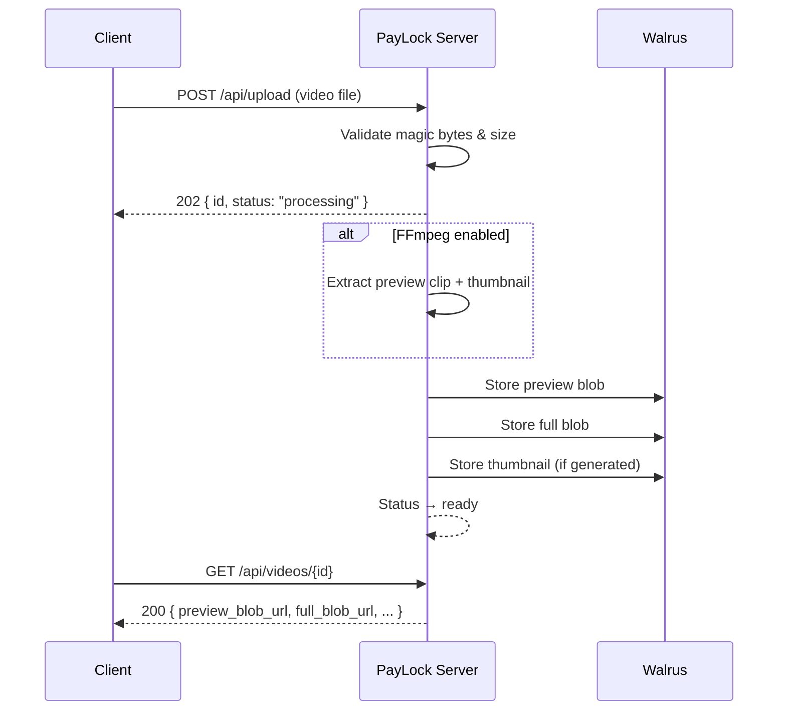
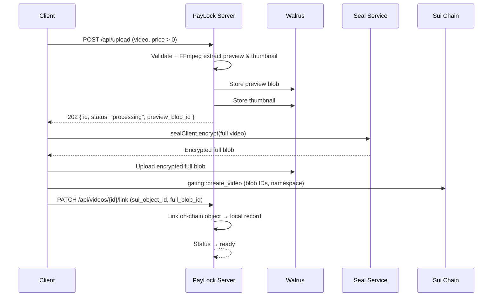
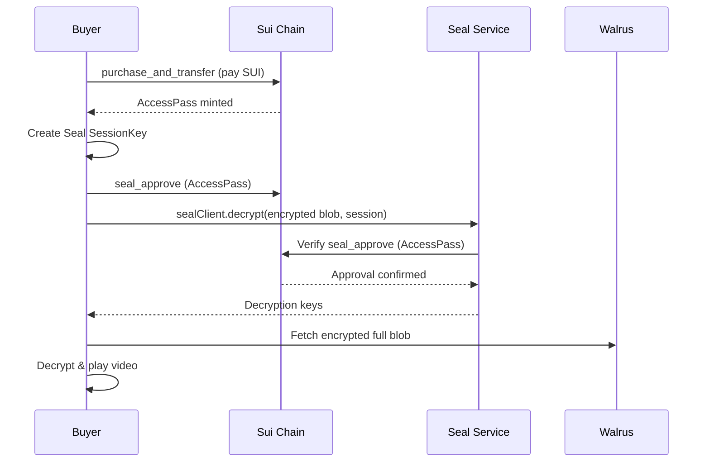

# PayLock — Decentralized Video Storage & Paywall on Sui

PayLock is a Go backend for decentralized video hosting. It stores video assets on [Walrus](https://walrus.xyz), serves playback via HTTP redirects to the Walrus Aggregator, and integrates with a Sui Move contract for on-chain paywalls. Includes optional FFmpeg-based preview/thumbnail generation, a chain watcher for automatic sync, and an embedded web UI.

## Features

- Upload and store videos on Walrus (MP4, MOV, WebM, MKV, AVI)
- Free and paid video flows with on-chain paywall via Sui Move contract
- FFmpeg preview extraction, thumbnail generation, and faststart optimization
- Real-time upload status via Server-Sent Events (SSE)
- Sui chain watcher that auto-syncs on-chain `Video` objects
- Embedded single-page frontend for uploads and playback
- Wallet signature authentication for creator operations

---

## How It Works

### Free Videos (price = 0)

1. Client uploads a video to `POST /api/upload`.
2. Server validates the file, optionally extracts a preview clip and thumbnail (FFmpeg), and uploads all blobs to Walrus.
3. Status transitions to `ready`. The video object (from `GET /api/videos/{id}`) contains `preview_blob_url` and `full_blob_url` for direct Walrus playback.

> When FFmpeg is disabled, the server skips preview extraction and uses the full file as the preview blob.



### Paid Videos (price > 0)

1. Client uploads the full video to `POST /api/upload` with `price > 0`. **FFmpeg is required.**
2. Server extracts a preview clip and thumbnail, uploads them to Walrus, and sets status to `processing` with `preview_blob_id` available.
3. Client encrypts the full video with [Seal](https://github.com/MystenLabs/seal) (`@mysten/seal`) and uploads the encrypted blob to Walrus.
4. Client calls `gating::create_video` on-chain with all blob IDs and the Seal namespace.
5. Client calls `PATCH /api/videos/{id}/link` with the `sui_object_id` and `full_blob_id` to immediately link the on-chain object.
6. Status transitions to `ready`. The video object contains `preview_blob_url` and `full_blob_url` for playback. (The chain watcher serves as a fallback if the PATCH fails.)



### Purchase Flow

1. Buyer calls `purchase_and_transfer` on-chain → mints an `AccessPass`.
2. Buyer creates a Seal `SessionKey`, builds a `seal_approve` Move call, and passes it to `sealClient.decrypt()` to obtain decryption keys.
3. Client decrypts the encrypted full blob in the browser and plays it.



### Streaming & IDs

- `/stream/{id}/preview` and `/stream/{id}/full` accept both `paylock_id` and `sui_object_id`.
- If a `paylock_id` has a linked on-chain object, the server redirects to the canonical `sui_object_id` URL with deprecation headers.

---

## On-Chain Contract

Source: `contracts/sources/gating.move`

| Item | Description |
|------|-------------|
| `Video` (shared object) | title, price, creator, blob IDs, seal namespace |
| `AccessPass` (owned object) | Proof of purchase for Seal decryption |
| `create_video` | Register a video on-chain |
| `delete_video` | Creator deletes their video |
| `purchase_and_transfer` | Pay and mint an AccessPass |
| `seal_approve` | Authorize Seal decryption (with AccessPass) |
| `seal_approve_owner` | Creator decrypts without AccessPass |
| `VideoCreated` / `VideoDeleted` events | Emitted for backend sync |

---

## Quick Start

### Prerequisites

- Go 1.25+
- FFmpeg + FFprobe (required for paid uploads; optional for free uploads)

### Run

```bash
cp .env.example .env   # edit as needed
make run               # go run ./cmd/paylock
```

### Environment Variables

| Variable | Default | Description |
|----------|---------|-------------|
| `PAYLOCK_PORT` | `8080` | HTTP listen port |
| `PAYLOCK_DATA_DIR` | `data` | Metadata storage directory |
| `PAYLOCK_WALRUS_PUBLISHER_URL` | `https://publisher.walrus-testnet.walrus.space` | Walrus Publisher API |
| `PAYLOCK_WALRUS_AGGREGATOR_URL` | `https://aggregator.walrus-testnet.walrus.space` | Walrus Aggregator API |
| `PAYLOCK_WALRUS_EPOCHS` | `5` | Walrus storage duration (epochs) |
| `PAYLOCK_MAX_FILE_SIZE_MB` | `500` | Upload size limit (MB) |
| `PAYLOCK_MAX_PREVIEW_SIZE_MB` | `50` | Preview size limit (MB) |
| `PAYLOCK_MAX_PREVIEW_DURATION` | `300` | Max preview duration (seconds) |
| `PAYLOCK_ENABLE_FFMPEG` | `true` | Enable FFmpeg processing |
| `PAYLOCK_FFMPEG_PATH` | `ffmpeg` | FFmpeg binary path |
| `PAYLOCK_FFPROBE_PATH` | `ffprobe` | FFprobe binary path |
| `PAYLOCK_SUI_RPC_URL` | `https://fullnode.testnet.sui.io:443` | Sui RPC endpoint |
| `PAYLOCK_GATING_PACKAGE_ID` | *(none)* | Deployed gating Move package ID |
| `PAYLOCK_WATCHER_INTERVAL` | `5` | Chain watcher poll interval (seconds) |

---

## Quick Integration (Free Video)

```js
const PAYLOCK = 'http://localhost:8080';

// 1. Upload
const form = new FormData();
form.append('video', file);
const { id } = await fetch(`${PAYLOCK}/api/upload`, { method: 'POST', body: form }).then(r => r.json());

// 2. Wait for processing (SSE)
await new Promise((resolve, reject) => {
  const es = new EventSource(`${PAYLOCK}/api/status/${id}`);
  es.onmessage = (e) => {
    const v = JSON.parse(e.data);
    if (v.status === 'ready') { es.close(); resolve(); }
    if (v.status === 'failed') { es.close(); reject(new Error(v.error || 'failed')); }
  };
  es.onerror = () => { es.close(); reject(new Error('SSE error')); };
});

// 3. Play — browser follows 307 redirect to Walrus
videoElement.src = `${PAYLOCK}/stream/${id}/preview`;
```

For the paid flow and full API reference, see `API.md`.

---

## License

MIT
